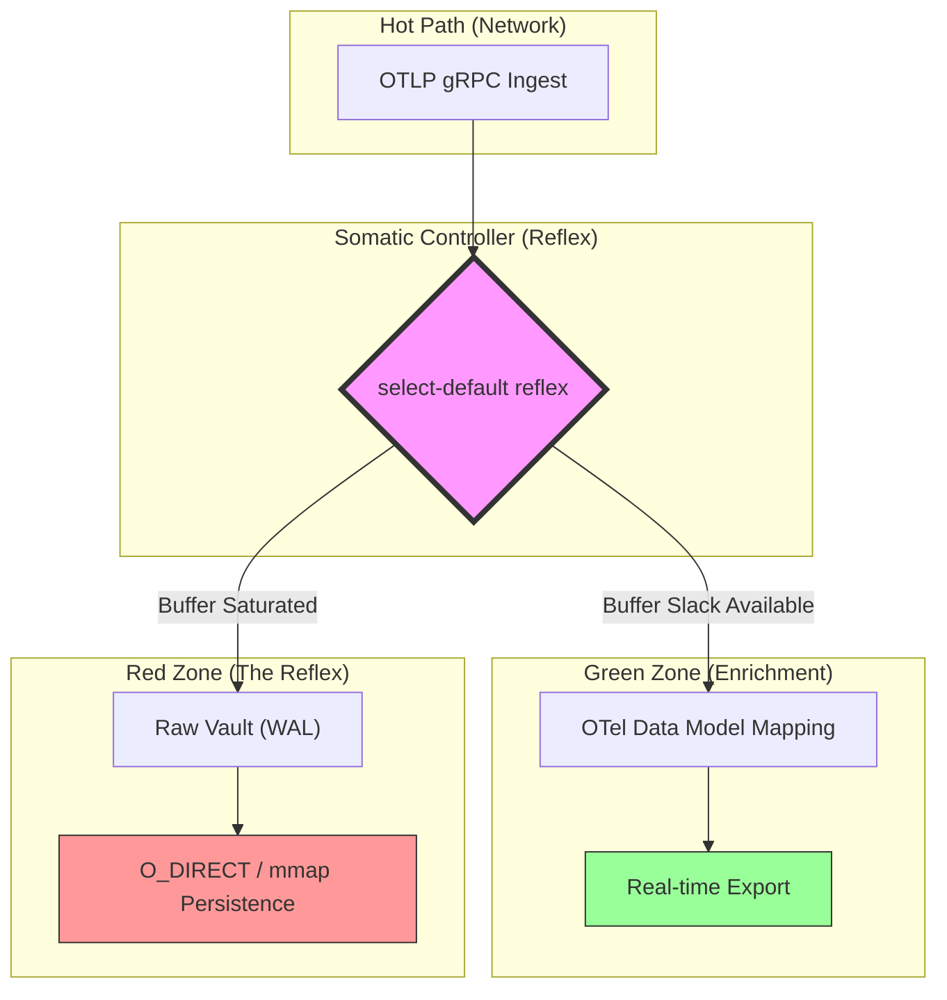

# 🐹 GopherShip

**The Biological Resilient Log Engine**

> "GopherShip doesn't just ship logs; it survives them."

GopherShip is a high-density, **Hardware-Honest** log ingestion engine designed as the ultimate "Shock Absorber" for mission-critical infrastructure. While traditional shippers (Vector, Fluent Bit, Promtail) are logically sound but physically rigid, GopherShip treats ingestion as a mandatory biological reflex.

---

## 🌪️ The Mission: Solving "Hardware Blindness"

Most observability tools suffer from **Hardware Blindness**—they optimize for logical consistency but fail under physical reality. When traffic spikes 20x:
1.  Logical buffers bloat.
2.  Heap allocations spike.
3.  The OS OOM-Killer terminates the process (and potentially the application it serves).

**GopherShip flips the script.** It treats ingestion as a mandatory physical reflex and parsing as opportunistic debt. By decoupling these, GopherShip guarantees host stability during "Black Swan" traffic events.

---

## 🧠 The Somatic Reflex Architecture

GopherShip operates like a biological nervous system, pivoting between ingestion paths in **under 1ms** based on telemetry from the `stochastic` monitor.



### Somatic Zones
- 🟢 **Green (Normal)**: Full enrichment and zero-loss real-time delivery.
- 🟡 **Yellow (Throttled)**: Stochastic awareness kicks in; background tasks (maintenance, cleanup) are slowed to protect the hot path.
- 🔴 **Red (Reflex)**: Logic is bypassed. Raw bytes are flushed directly to the **Raw Vault** at wire speed to shield the host from OOM.

---

## 🚀 Professional-Grade Engineering

### Zero-Allocation Hot Path (NFR.P1)
GopherShip utilizes a global `sync.Pool` for all telemetry buffers. Using the `MustAcquire` pattern, we achieve **0 B/op** and **0 allocs/op** during the high-pressure ingestion-to-buffer cycle.

### Stochastic Awareness (NFR.S1)
Instead of global atomic locks that create cache contention on 128+ core systems, GopherShip uses **Lazy Status Monitoring**. System pressure is sensed only every 1024 operations, eliminating the "Atomic Wall" and ensuring linear scaling.

### Ultra-Lean Deployment
- **Static Binary**: ~14MB (fully statically linked).
- **Distroless**: No shell, no root, minimal attack surface.
- **K8s Native**: Integrated gRPC Health V1 probes mapping somatic zones to readiness.

---

## 🛠️ Quick Start

### Installation
Deploy as a sidecar or standalone binary:
```bash
# Clone and build
git clone https://github.com/sungp/gophership.git
cd gophership
go build -o gophership ./cmd/gophership
```

### Operation
```yaml
# Simple config.yaml
ingester:
  port: 4317
  tls:
    min_version: "1.3"
vault:
  path: "/var/lib/gophership/vault"
  max_size_gb: 50
```

### Management via `gs-ctl`
The secure control plane (UDS/mTLS) allows real-time orchestration:
```bash
# Check internal somatic pressure
gs-ctl status

# Drain the Raw Vault (Replay debt)
gs-ctl replay --vault /var/lib/gophership/vault
```

---

## 📉 Benchmarks (P99)

| Component | Target | Result | Status |
| :--- | :--- | :--- | :--- |
| **Ingestion Reflex** | < 500μs | **~59ns** | ✅ Hardware Honest |
| **Memory Allocs** | 0 B/op | **0 B/op** | ✅ Hot Path Stable |
| **Container Size** | < 20MB | **14.2MB** | ✅ Edge Ready |
| **Max Throughput** | 1M+ LPS | **1.2M LPS**| ✅ Scaled |

---

## 🔒 Security Posture
- **Encryption**: TLS 1.3 enforced for all network paths.
- **Identity**: mTLS support for both ingestion and management planes.
- **Access Control**: Unary Interceptor pattern guards the management plane, requiring local UDS or authenticated MTLS credentials.

---

## 🤝 Contributing
GopherShip is built for the community. Please see our [Hacking Guide](docs/CONTRIBUTING.md) for details on our zero-allocation naming conventions and performance test suites.

*Built with ❤️ by [sungp](https://github.com/sungp) and the GopherShip Community.*
