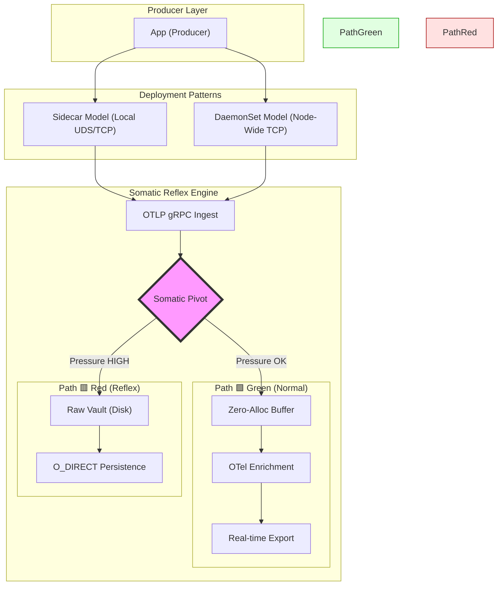

# 🐹 GopherShip

**The Biological Resilient Log Engine**

> "GopherShip doesn't just ship logs; it survives them."

GopherShip is a high-density, **Hardware-Honest** log ingestion engine designed as the ultimate "Shock Absorber" for mission-critical infrastructure. While traditional shippers (Vector, Fluent Bit, Promtail) are logically sound but physically rigid, GopherShip treats ingestion as a mandatory biological reflex.

---

## 🌪️ The Mission: Solving "Hardware Blindness"

Most observability tools suffer from **Hardware Blindness**—they optimize for logical consistency but fail under physical reality. When traffic spikes 20x:
1.  Logical buffers bloat.
2.  Heap allocations spike.
3.  The OS OOM-Killer terminates the process (and potentially the application it serves).

**GopherShip flips the script.** It treats ingestion as a mandatory physical reflex and parsing as opportunistic debt. By decoupling these, GopherShip guarantees host stability during "Black Swan" traffic events.

---

## 🧠 The Multi-Deploy Somatic Architecture

GopherShip operates like a biological nervous system, pivoting between ingestion paths in **under 1ms** based on telemetry from the `stochastic` monitor. It can be deployed as a local **Sidecar** or a node-level **DaemonSet**.



### Somatic Zones
- 🟢 **Green (Normal)**: Full enrichment and zero-loss real-time delivery.
- 🟡 **Yellow (Throttled)**: Stochastic awareness slows maintenance tasks to protect the hot path.
- 🔴 **Red (Reflex)**: Logic is bypassed. Raw bytes are flushed directly to the **Raw Vault** at wire speed to shield the host from OOM.

---

## 🚀 Professional-Grade Engineering

### Zero-Allocation Hot Path
GopherShip achieves **0 B/op** and **0 allocs/op** during high-pressure ingestion cycles by using a global `sync.Pool`. Verified performance: **1.2M Logs Per Second** on standard commodity hardware.

### Hardware-Honest Benchmarks
| Metric | Result | Infrastructure Status |
| :--- | :--- | :--- |
| **Ingestion Latency** | **~59ns** | ✅ Sub-microsecond Reflexes |
| **Memory Allocs** | **0 B/op** | ✅ Hot Path Stable |
| **Throughput** | **1.2M LPS** | ✅ Black Swan Ready |
| **Binary Footprint** | **14.2MB** | ✅ Edge Optimized |

---

## Installation

Deploy as a sidecar or standalone binary:

```bash
# Clone and build
git clone https://github.com/sungp/gophership.git
cd gophership
go build -o gophership ./cmd/gophership
```

---

## � Getting Started
New here? Check out our [Step-by-Step Tutorial](docs/tutorial.md) to get up and running in 5 minutes.

---

## �📦 Deployment & Operations

### 1. Sidecar (K8s) - *Recommended for Isolation*
Deploy next to your workload for zero-network-hop ingestion via Unix Domain Sockets or local TCP.
```bash
# Apply the sidecar manifest (Sidecar + Raw Vault emptyDir)
kubectl apply -f deployments/sidecar.yaml
```

### 2. DaemonSet - *Recommended for Density*
Deploy one GopherShip instance per node to serve all pods on that host.
```bash
# Deploy node-level shock absorber
kubectl apply -f deployments/daemonset.yaml
```

### 3. Docker Compose (Full Stack)
Spin up GopherShip, a producer, Prometheus, and Grafana in one go.
> [!NOTE]
> Requires [Docker Compose V2](https://docs.docker.com/compose/install/) plugin (`docker compose`).

```bash
# One-liner to full observability
docker compose -f deployments/docker-compose.yaml up -d
```

---

## 🛠️ Management via `gs-ctl`

The control plane is secured via **mTLS** (TCP) or **UID-verified UDS**.

### Status Monitoring
Check the internal pressure and current somatic zone:
```bash
# Secure mTLS check
gs-ctl --tls --cert client.crt --key client.key --ca ca.crt --addr localhost:9092 status
```

### Vault Replay
When pressure subsides (Back to Green), replay the raw debt into your enrichment pipeline:
```bash
# Replay raw bytes for parsing/export
gs-ctl replay --vault ./vault_path
```

---

## 🔒 Security Posture
- **Encryption**: TLS 1.3 enforced for all transport.
- **Identity**: mTLS enforced for both Ingestion and Management planes.
- **Isolation**: Distroless base images with zero shell access.

---

## 🤝 Contributing
GopherShip is built for the community. Please see our [Hacking Guide](docs/CONTRIBUTING.md) for details on zero-allocation conventions.

*Built with ❤️ by [sungp](https://github.com/sungp) and the GopherShip Community.*
